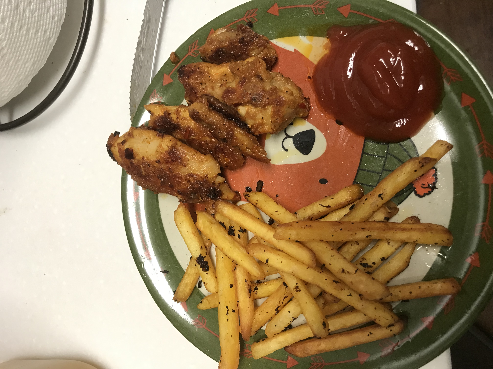
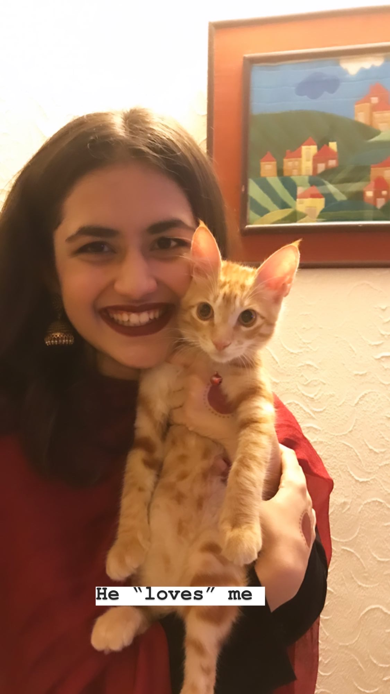

# Introduction 
Hello, I am a Computer Science grad student at The Pennsylvania State University (GO NITTANY LIONS!). Previosuly, I was at National University of Sciences and Technology (NUST-Pakistan). I completed my Bachelors in Computer Science there, and moved to the US immediately. Moving to a completely new country exposes you to a ton of challenges and difficulties, but I couldn't be more grateful for the opportunities I get everyday. 

[LinkedIn](https://www.linkedin.com/in/tatheer-zahra14) | [Twitter](https://www.twitter.com/TatheerZahara) | [Email](mailto:tatheer13@gmail.com) | [Facebook](https://www.facebook.com/tatheer.zahara.75/) | [Instagram](https://www.instagram.com/tatheer10/)

## What am I doing currently? 
1. Learning how to cook (One of the most difficult things I have ever done, haha).   
2. Working with Dr. Syed Rafiul Hussain on **5G** Technologies. We would potentially work on addressing access control issues. 
3. Developing a **Thread Migrator** for my **Operating Systems** course. [Technologies: C/C++]

## Work/Internship Experience

### Research Assistant @ SynSync-Presently
* As mentioned above, I am working with Dr. Rafiul on 5G. 

### Research Assistant @ Deep Learning Lab  
* Improved **Deep SVDD** [framework by Lukas Ruff] for **anomaly detection** using One Class Classification.  
* Modified the pre-training and post-training of autoencoders for better results in benchmark anomaly datasets **[CIFAR, MNIST, FMNIST]**.  
* Introduced a novel **three prong technique** for detecting outliers in various datasets. [Technologies: Python; pytorch]  
[View on Github](https://github.com/TatheerZahara/Deep-SVDD-PyTorch-experiments.git)

### Research Assistant @ CYPHYNETS  
* Worked on automating crop classification using geotechnical data from **Google Earth Engine**.  
* Utilized **CNNs (VGG-16)** for accurate classification of crops.  
*I worked on this project during my Sophomore year, and it recently got published. [Have a look at it!](https://ieeexplore.ieee.org/document/9506046)* 

### Teaching Assistant [CMPSC 131: Programming and Computation]-Presently       
* CMPSC-131 has **850** students, and I am responsible for **300**. 
* Conducting weekly recitations for **5** sections.  Additionally, grading and conducting office hours. 

## Projects

### Multi-threaded Web-crawler [C++] [View on Github](https://github.com/TatheerZahara/Multi-threaded-Web-Crawler-Using-Priority-Queues-.git)
* Devised a novel Linux-based web-crawler using **priority queues** for ordering searched words and URLs.
* Introduced **parallelism** by using multiple threads for queue traversal. 

### Reliable UDP [C/C++] [View on Github](https://github.com/TatheerZahara/Reliable-UDP.git)
* Imitated the benefits of TCP by adding sequence numbers and selective repeat for **reducing packet loss**. 

### Red Black Tree [C++] [View on Github](https://github.com/TatheerZahara/Red-Black-Tree-Implementation.git)

### Piano Tiles using Object Oriented Programming [Java] [View on Github](https://github.com/TatheerZahara/Piano-Tiles-Using-Object-Oriented-Programming.git)

### Lawyers Management System [Web]

## Non-Technical Work Experience 
During the four years of my undergrad, I worked with multiple organizations as a freelancer. Following is a summary of my work experience: 

### Crypto News Writer and Technical Marketer @ ICO Announcements & Chain Social
* Managed marketing of **30-40** crypto companies each month (social media, web content, and Telegram groups).
* Critiqued new crypto initiatives and wrote blog pieces on them. 
* Edited and written whitepapers for crypto projects. 

### Technical Copywriter @ Wordsmiths, Inc.                                                                                         
### Marketing and Intern @ Cykiq, National Sciences and Technology Park                                        
### Marketing Intern @ SIMSIM Finca                                                                                                    
### Technical Writer @ Arfa Software Technology Park 

## Education 
**The Pennsylvania State University**  
Fall'21

**National University of Sciences and Technology**  
CGPA: **3.58**/4.00        Graduated: 2021

## Things I love 
- ANIMALS!   Fun Fact: I have a cat named Trignometry back home. He is my little spoiled brat.     In the US, my roommate has a cat and A SNAKE! 
- Working out and eating clean 

